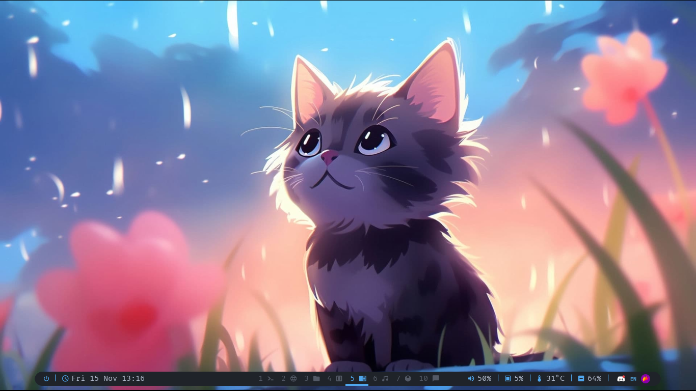
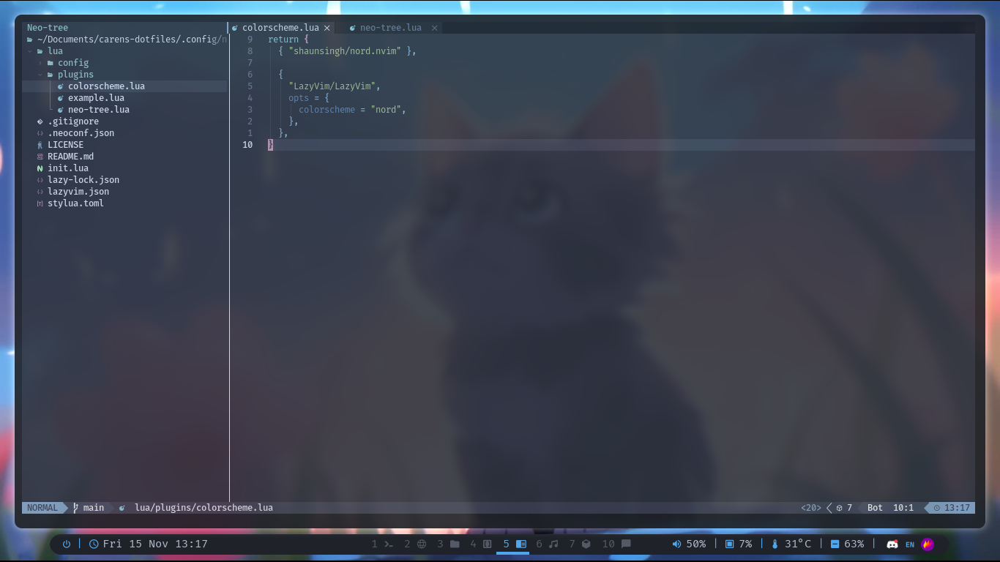
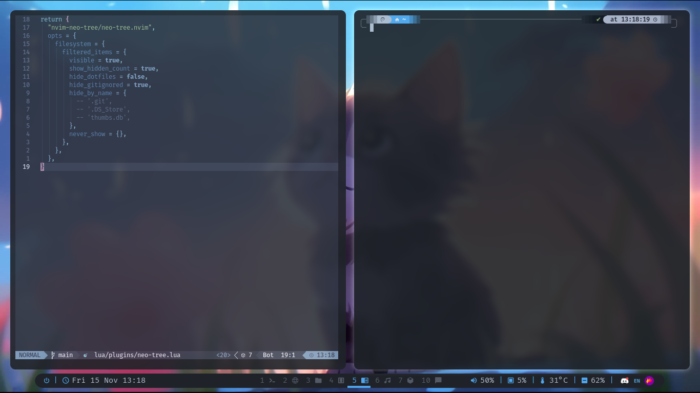

Screenshots:

i3 initial setup:
https://codeberg.org/cizordj/i3-themer

some dotfiles reference from:
https://github.com/brainfucksec/dotfiles

### Setup:

| Component         | Application                    |
| ----------------- | ------------------------------ |
| OS                | Parrot Security 6.4 (lorikeet) |
| Shell             | zsh with oh my zsh             |
| Compositor        | fastcompmgr                    |
| Terminal Emulator | Alacritty                      |
| Window Manager    | i3                             |
| Bar               | polybar                        |
| Program Launcher  | rofi                           |
| Themes            | Nordic                         |
| Icons             | Papirus                        |
| File Manager      | Thunar File Manager            |
| Image Viewer      | gThumb                         |
